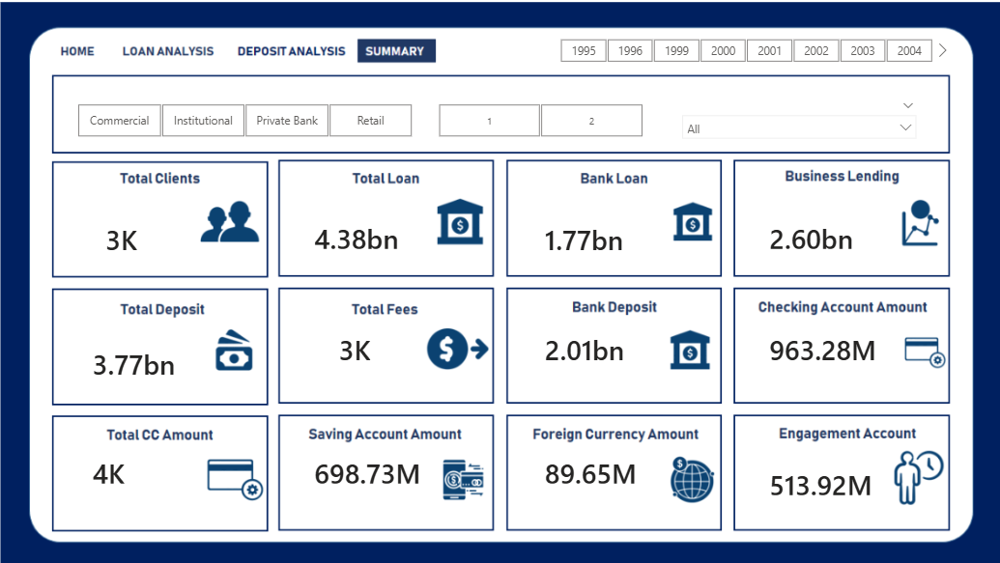
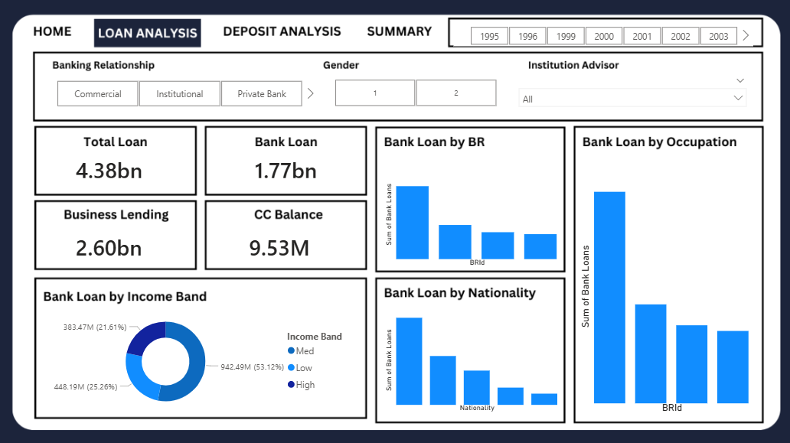
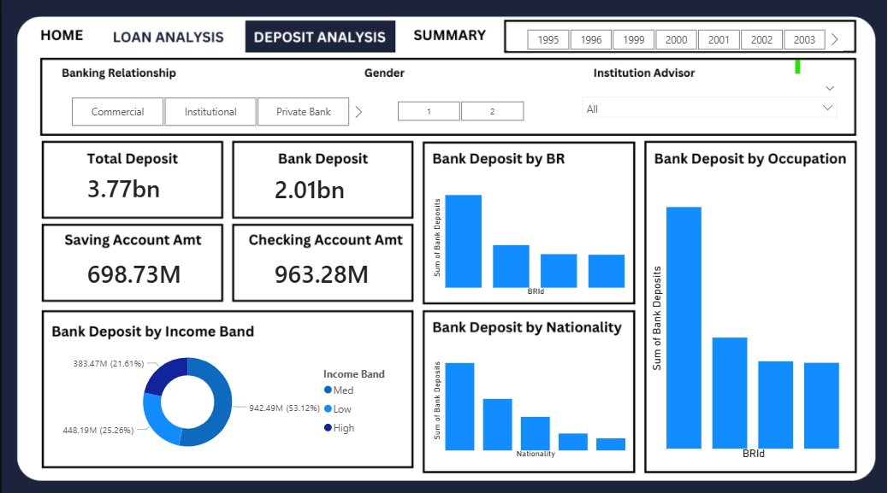

# Banking Domain Analysis: Financial Performance & Portfolio Insights

### **End-to-End Data Pipeline: SQL Server → Python → Power BI**

---

## 🎯 Project Objective
This project focuses on analyzing the banking lifecycle—from customer acquisition to financial portfolio management. By processing raw transactional and demographic data, the objective is to provide stakeholders with clear visibility into **Loan Assets**, **Deposit Liabilities**, and **Customer Segment Performance** to optimize banking operations and risk assessment.

## 📊 1. Executive Summary Dashboard
This view provides a high-level overview of the bank’s total footprint, allowing for a quick health check of the financial institution.

* **Key Metric:** Consolidates total balances, average transaction values, and customer counts into a unified KPI set.
* **Navigation:** Built with a modular design to toggle between high-level summaries and deep-dive financial reports.

## 📈 2. Strategic Business Insights
Based on the data analysis, the following high-impact insights were identified:
* **Portfolio Diversification:** Analysis of the loan distribution highlights the concentration of risk across different loan types, allowing management to balance the portfolio between retail and business lending.
* **Deposit Stability:** Identified trends in customer deposits that show which segments contribute most to the bank's liquidity, helping to design targeted retention strategies for high-net-worth individuals.
* **Customer Demographics:** Insights into age groups and occupations suggest that specific professional sectors have a higher propensity for maintaining positive savings balances.
* **Data-Driven Operations:** By moving from manual CSV tracking to an automated SQL-to-BI pipeline, reporting time is significantly reduced while maintaining data integrity.

## 🔍 3. Data Analysis & Transformation
To ensure the reliability of the dashboard, a structured data engineering approach was taken:
* **ETL Process:** Raw data from `Banking.csv` was cleaned in Python to handle anomalies and ensure consistency across financial fields.
* **Structured Querying:** `bank.sql` scripts were utilized to create optimized views, ensuring the Power BI model remains performant and scalable.
* **Visual Storytelling:** Developed complex DAX measures in Power BI to calculate running totals, average balances, and year-over-year growth.

## 🛠️ Technology Stack
* **SQL Server:** For structured data storage, data cleaning, and creating analytical views.
* **Python (Jupyter Notebook):** For Exploratory Data Analysis (EDA) and data profiling.
* **Power BI:** For building interactive visualizations, data modeling, and UI/UX design.

## 📂 Repository Contents
* **bd.pbix:** Interactive Power BI file containing all analytical views.
* **banking.ipynb:** Python code for data preprocessing and exploration.
* **bank.sql:** SQL transformation and querying scripts.
* **Banking.csv:** The source dataset for the analysis.
* **Project Visuals:** `Summ.png`, `loan.png`, and `deposit.png` for quick reference.

---

### 🖼️ Dashboard Preview

| **Summary View** | **Loan Analysis** | **Deposit Analysis** |
| :--- | :--- | :--- |
|  |  |  |

---
**Contributor:** [Anchal1811](https://github.com/Anchal1811)
