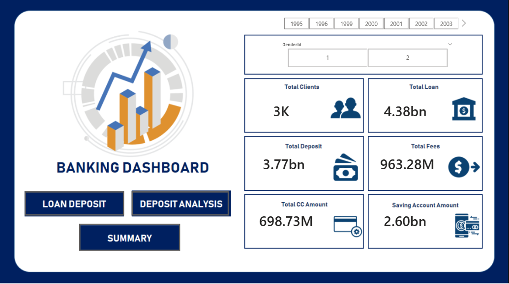

# Banking Domain Analysis: Risk & Portfolio Intelligence

### **End-to-End Data Pipeline: SQL Server → Python → Power BI**

---

## 🎯 Project Objective
The primary goal of this project is to perform **Risk Analysis** on a banking portfolio to minimize financial loss and optimize lending strategies. By analyzing customer credit health, loan distributions, and deposit stability, this project provides a framework for identifying high-risk segments and ensuring the bank maintains healthy liquidity ratios.

## 📊 1. Executive Summary Dashboard
This view provides a high-level overview of the bank’s total footprint, allowing for a quick health check of the financial institution and its exposure to risk.

* **Key Metric:** Consolidates total balances, average transaction values, and customer counts into a unified KPI set.
* **Risk Monitoring:** Built with a modular design to toggle between asset risk (loans) and liability stability (deposits).

## 📈 2. Strategic Business Insights (Risk Analytics Focus)
Based on the data analysis, the following high-impact insights were identified:
* **Credit Risk Assessment:** Analysis of the loan distribution highlights the concentration of risk across different loan types, allowing management to balance the portfolio between retail and business lending.
* **Liquidity Risk Management:** Identified trends in customer deposits that show which segments contribute most to the bank's liquidity, helping to design targeted retention strategies for high-net-worth individuals.
* **Demographic Vulnerability:** Insights into age groups and occupations suggest that specific sectors exhibit higher volatility in maintaining savings balances, requiring more conservative lending limits.
* **Risk-Adjusted Operations:** By moving from manual CSV tracking to an automated SQL-to-BI pipeline, reporting time is significantly reduced while maintaining a "single source of truth" for risk metrics.

## 🔍 3. Data Analysis & Transformation
To ensure the reliability of the dashboard, a structured data engineering approach was taken:
* **ETL Process:** Raw data from `Banking.csv` was cleaned in Python to handle anomalies and ensure consistency across financial fields.
* **Structured Querying:** `bank.sql` scripts were utilized to create optimized views, ensuring the Power BI model remains performant and scalable.
* **Visual Storytelling:** Developed complex DAX measures in Power BI to calculate running totals, average balances, and risk-weighted growth.

## 🛠️ Technology Stack
* **SQL Server:** For structured data storage, data cleaning, and creating analytical views.
* **Python (Jupyter Notebook):** For Exploratory Data Analysis (EDA) and data profiling.
* **Power BI:** For building interactive visualizations, data modeling, and UI/UX design.

## 📂 Repository Contents
* **bd.pbix:** Interactive Power BI file containing all analytical views.
* **banking.ipynb:** Python code for data preprocessing and exploration.
* **bank.sql:** SQL transformation and querying scripts.
* **Banking.csv:** The source dataset for the analysis.
* **Project Visuals:** `Summ.png`, `loan.png`, `deposit.png`, and `dashboard.png`.

---

### 🖼️ Deep-Dive Analysis
| **Summary View** | **Loan Analysis** | **Deposit Analysis** |
| :--- | :--- | :--- |
|  |  |  |

---
**Contributor:** [Anchal1811](https://github.com/Anchal1811)
